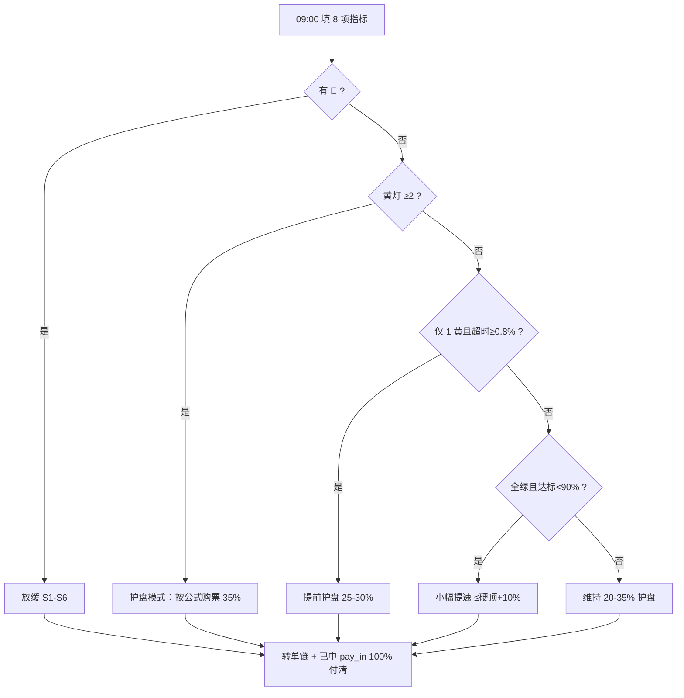

# 百万会员运营手册 · 护盘 / 排单 / 提速

> **终极目标**：真实会员 **100 万**（月份可顺延，不可虚假冲量）  
> **配套**：[稳定路线图](./stable-growth-roadmap-zh.md) · [pool-v4 算法](./pool-v4-algorithm-zh.md)  
> **用法**：运营早班 **10 分钟**照本执行；决策层 **每周/每月**复盘

---

## 1. 一张图看懂今天干什么




**口诀**：先看病（超时）→ 再看队（积压）→ 最后看数（会员）。**付款不能崩，会员可以慢。**

---

## 2. 每天必看 8 项（怎么看）


| #   | 指标                 | 怎么算                                           | 去哪看      | 今天重点         |      |                   |
| --- | ------------------ | --------------------------------------------- | -------- | ------------ | ---- | ----------------- |
| 1   | **付款超时率（7日）**      | 近7日 `pay_expired` ÷ 近7日 `pay_pending` ×100%   |          |              | 引擎回放 | **最重要**；>0.8% 要动作 |
| 2   | **收款积压率**          | (`recv_queued`+`recv_partial`) ÷ 活跃排队人数 ×100% | 引擎回放     | >18% 警惕排队过长  |      |                   |
| 3   | **今日 pay_pending** | 当日匹配后待付人数                                     | 当日匹配结果   | 和临期未付一起看     |      |                   |
| 4   | **临期未付**           | 当前 `payer` 距本级 deadline **<12h** 人数           | 引擎回放     | ≥1 检查转单是否执行  |      |                   |
| 5   | **今日日新增**          | 链上 100 TRX 门票笔数                               | TronGrid | 对比硬顶         |      |                   |
| 6   | **日新增占用率**         | 今日日新增 ÷ 阶段硬顶 ×100%                            | 台账       | >100% = 违规冲量 |      |                   |
| 7   | **里程碑达标率**         | 累计会员 ÷ 当月目标 ×100%                             | 台账       | <90% 可考虑提速   |      |                   |
| 8   | **我方护盘占比（7日）**     | 护盘地址门票 ÷ 全站门票 ×100%                           | 链上+标签    | 维持 20–35%    |      |                   |


### 2.1 三色判色（每项独立，取最严重色 = 当日总控）


| 指标       | 🟢 绿    | 🟡 黄              | 🔴 红                    |
| -------- | ------- | ----------------- | ----------------------- |
| 超时率（7日）  | ≤0.8%   | 0.8–1.2%          | >1.2%                   |
| 积压率      | ≤18%    | 18–25%            | >25%                    |
| 临期未付     | 0 人     | 1–20 人            | >20 人或 >pay_pending 15% |
| 达标率      | 90–110% | 80–90% 或 110–120% | <80%且付款恶化；或 >120%且积压升   |
| 护盘占比（7日） | 20–35%  | <20%且积压升；或 35–40% | >40%                    |


**Ⅰ 阶段冷启动收紧**：超时 >0.5% 即黄，>0.8% 即红。

### 2.2 当日总控 → 动作一览


| 总控          | 条件                                     | 今日做什么                               |
| ----------- | -------------------------------------- | ----------------------------------- |
| **🔴 放缓**   | 任一指标 🔴                                | 见 §5；**不买新护盘票**，只付清已中 `pay_in` + 转单 |
| **🟡 护盘**   | 无 🔴 且 **≥2 项 🟡**                     | 见 §3；护盘购票目标 **35%**                 |
| **🟡 提前护盘** | 仅 1 黄 且 超时 ≥0.8%                       | 护盘购票 **25–30%**                     |
| **🟢 维持**   | 其余                                     | 护盘购票 **20–35%**（默认 **30%**）         |
| **🟢 提速**   | 全绿 且 达标率 **<90%** 且 超时 ≤0.8% 且 积压 ≤18% | 见 §4；硬顶 **+10%** 最多 7 天             |


---

## 3. 什么时候护盘进场排单 · 排多少单

### 3.1 护盘是什么（再次强调）

```
买票 100 TRX → pay_queued →（满进场期+匹配）→ pay_in → 出场池 → recv_queued → 再买票
```

- **无绿色通道**：不插队、不缩短进场期、不优先匹配  
- **一人一单**：每个护盘地址同时只能有 **1 笔**开放订单 → 多地址分散排单  
- **铁律**：**谁付谁收，认准链上地址**（转单后验新 `payer`）

### 3.2 触发护盘排单的条件


| 优先级 | 触发条件                      | 动作                       |
| --- | ------------------------- | ------------------------ |
| P0  | **任一 🔴**                 | **不排新单**；只履约付款 + 转单兜底    |
| P1  | **≥2 项 🟡**（无 🔴）         | **护盘模式**：当日购票占全站 **35%** |
| P2  | **1 项 🟡** 且 超时率 ≥0.8%    | **提前护盘**：当日购票 **25–30%** |
| P3  | 护盘占比 <20% **且** 积压日环比 +2% | 维持模式内提到 **30%**          |
| P4  | 临期未付 ≥10 人                | 护盘模式占比 **35%** + 批量转单    |


**不是护盘的情况**：全绿、付款健康 → 维持 20–35%，不必刻意加满。

### 3.3 排多少单 · 计算公式（每日 09:00 算一次）

```
H  = 当日阶段硬顶（见 §6 阶段表）
α  = 当日护盘占比目标（见 §3.4）
P  = round(H × α)                    // 护盘目标购票数（张）
M  = H - P                           // 留给会员的购票额度（张）

已购全站 = 今日 00:00 至今链上门票总数
已购护盘 = 今日护盘标签地址门票数
已购会员 = 已购全站 - 已购护盘

今日还需护盘购票 = max(0, min(P - 已购护盘, H - 已购全站))
```

**执行规则：**

1. **先算后买**：09:00 看会员已购多少，再决定护盘买几张
2. **不超硬顶**：`已购全站 + 今日还需护盘 ≤ H`
3. **分散地址**：每张票一个地址（一人一单）；N 张票 = N 个护盘地址各买 1 张
4. **红线**：护盘占比 **≤40%**；全站 **≤H**

### 3.4 护盘占比 α 怎么取


| 当日总控                | α（占全站硬顶）               |
| ------------------- | ---------------------- |
| 🔴 放缓               | **0%**（不新排）            |
| 🟡 护盘（≥2黄）          | **35%**                |
| 🟡 提前护盘（1黄+超时≥0.8%） | **25–30%**（默认 28%）     |
| 🟢 维持               | **20–35%**（默认 **30%**） |
| 🟢 提速               | **20–25%**（把额度让给会员）    |


加码（在护盘模式下叠加上限，仍 ≤40%）：


| 再加条件      | α               |
| --------- | --------------- |
| 超时率 ≥0.8% | 至少 **35%**      |
| 临期未付 ≥10  | 至少 **35%**      |
| 积压日环比 +2% | 维持 35%，**禁止提速** |


### 3.5 分阶段排单参考表（硬顶打满时）

> 以下为 **目标张数**，实际 = §3.3 公式扣掉会员已购后的余额。


| 阶段  | 月份    | 会员区间      | 硬顶 H     | 维持 30%  | 护盘 35%  | 上限 40%  |
| --- | ----- | --------- | -------- | ------- | ------- | ------- |
| Ⅰ   | 1–12  | →3千       | **15**   | **5**   | **5**   | **6**   |
| Ⅱ   | 13–24 | →2万       | **80**   | **24**  | **28**  | **32**  |
| Ⅲ   | 25–36 | →10万      | **320**  | **96**  | **112** | **128** |
| Ⅳ   | 37–54 | →60万      | **1500** | **450** | **525** | **600** |
| Ⅴ   | 55–66 | →**100万** | **2200** | **660** | **770** | **880** |
| Ⅵ   | 67–78 | 稳态        | **5**    | **2**   | **2**   | **2**   |


**举例（阶段 Ⅰ，护盘模式）：**

- H=15，α=35% → P=5 张  
- 会员今早已购 8 张 → 已购全站 8，还能买 15-8=**7** 张，但护盘只需 5-0=**5** 张  
- 用 **5 个护盘地址** 各买 1 张 100 TRX，分散排入 `pay_queued`

**举例（阶段 Ⅴ 冲刺百万，维持模式）：**

- H=2200，α=30% → P=660 张/日  
- 需 **约 660 个护盘地址** 轮询排单（或地址池滚动：出场后再买下一单）  
- 会员额度 M=1540 张/日

### 3.6 护盘地址中了 `pay_pending` 怎么办


| 情况      | 动作                      |
| ------- | ----------------------- |
| 我方地址中标  | **24h 内**从该地址打出场池（0 超时） |
| 会员未付    | 按转单链：会员→上级→中心→我方（§7）    |
| 临期未付 ≥1 | 核对引擎是否已转单；该转未转立即转       |


---

## 4. 什么时候提速 · 提多少

### 4.1 提速前置（必须全部满足）


| #   | 条件                         |
| --- | -------------------------- |
| 1   | **无 🔴**（连续 7 天）           |
| 2   | **黄灯 ≤1**                  |
| 3   | 超时率（7日）**≤0.8%**           |
| 4   | 积压率 **≤18%**               |
| 5   | 里程碑达标率 **80%–95%**（落后但不太远） |
| 6   | 临期未付 **=0** 或均已转单          |
| 7   | 未在执行放缓 S1–S6               |


### 4.2 提速幅度


| 项目         | 调整                                         |
| ---------- | ------------------------------------------ |
| 日新增硬顶      | **+10%**，最长 **7 天**，仍 ≤ 阶段表基准的 **+10%** 上限 |
| 护盘占比 α     | **降至 20–25%**（把票让给会员）                      |
| 进场期 / 付款时限 | **不变**（提速不加压付款）                            |
| 宣传         | 可恢复温和拉新，**禁止**「冲量话术」                       |


### 4.3 提速后 7 天内每日检查

任一出现 → **立刻取消提速**，回到维持或护盘：

- 超时率 >0.8%  
- 积压率 >18%  
- 临期未付 ≥5  
- 单日 `pay_expired` >3

### 4.4 不能提速的情况


| 情况             | 原因             |
| -------------- | -------------- |
| 任一 🔴          | 先放缓            |
| ≥2 黄           | 护盘，不提速         |
| 达标率 >110% 且积压升 | 超前冲量，主动减速      |
| 达标率 <80% 且付款恶化 | 不是慢，是病，先治病     |
| 百万已达标（≥100万）   | 进入 Ⅵ 稳态，日新增 ≤5 |


---

## 5. 什么时候放缓（红线动作）

满足 **任一条** 即当日执行：


| #   | 条件                                     | 动作                          |
| --- | -------------------------------------- | --------------------------- |
| S1  | 超时率（7日）**>1.2%**                       | 硬顶 **减半** 7 天               |
| S2  | 积压率 **>25%**                           | 硬顶 ≤50% + 进场期 **+7 天**      |
| S3  | 临期未付 **>20** 或单日 `pay_expired` **>10** | 停拉新 **3 天** + 付款时限 **+24h** |
| S4  | 连续 3 天溢出 **>10 万** 且超时升                | 硬顶减半至恢复绿区                   |
| S5  | 达标率 **>115%** 且积压 **>20%**             | 主动减速                        |
| S6  | **任意 2 项 🔴** 同日                       | 停拉新 **7 天** + 进场期 **+15 天** |


**放缓日护盘**：α=**0%** 新排单；资源全给 **转单 + 已中 pay_in 付清**。

---

## 6. 百万路径 · 阶段硬顶与验收


| 阶段  | 月份    | 会员目标          | 日硬顶 H | 付款时限 | 关键验收           |
| --- | ----- | ------------- | ----- | ---- | -------------- |
| Ⅰ   | 1–12  | 3,000         | 15    | 48h  | 超时 <0.5%，建立转单链 |
| Ⅱ   | 13–24 | 20,000        | 80    | 48h  | 超时 <1%         |
| Ⅲ   | 25–36 | 100,000       | 320   | 72h  | 积压可控           |
| Ⅳ   | 37–54 | 600,000       | 1500  | 72h  | 无大规模 expired   |
| Ⅴ   | 55–66 | **1,000,000** | 2200  | 96h  | **百万收官**       |
| Ⅵ   | 67–78 | 1,020,000     | 5     | 96h  | 消化积压           |


**顺延规则**：付款恶化 → 暂停提速、触发放缓；月份可从 66 延到 **72–78**，**目标 100 万不变**。

**收官三条件**（同时满足才宣布软着陆）：

1. 真实会员 ≥ **1,000,000**
2. 积压率 < **15%**
3. 超时率 < **1.5%**

---

## 7. 付款转单链（简要）

**铁律：谁付谁收，认准链上地址。**


| 级别  | 当前 payer | 24h 未付 →             |
| --- | -------- | -------------------- |
| L0  | 中标会员     | 转 **上级地址**           |
| L1  | 上级       | 转 **服务中心地址**         |
| L2  | 服务中心     | 转 **我方兜底地址**         |
| L3  | 我方       | 仍无到账 → `pay_expired` |


转单后链上只验 **新 payer** 的 `fromAddress`。详见 [路线图 §14.8](./stable-growth-roadmap-zh.md#148-付款转单链会员--上级--服务中心--我方最终不收不到款)。

---

## 8. 每日 10 分钟台账（打印用）


| 日期  | 超时7日% | 积压% | 临期  | 日新增/硬顶 | 达标% | 护盘7日% | 总控  | α   | **今日护盘还需购** | 动作  |
| --- | ----- | --- | --- | ------ | --- | ----- | --- | --- | ----------- | --- |
|     |       |     |     |        |     |       |     |     |             |     |


**填表步骤：**

1. 填 8 项 → 判色 → 定总控
2. 查阶段表得 H
3. 查 §3.4 得 α
4. 算 `今日护盘还需购` = §3.3 公式
5. 分配护盘地址买票；盯转单与 `pay_pending` 付款

---

## 9. 周 / 月复盘清单

### 每周（运营）

- 7 日超时率趋势：升/降？  
- 积压率趋势：升/降？  
- 护盘购票是否超 40%？  
- 转单成功率（上级/中心/我方各层）  
- 本周是否误提速/冲过硬顶？

### 每月（决策）

- 里程碑达标率：顺延还是 ±10% 调硬顶？  
- 是否触发 §10 崩盘红线？  
- 护盘比例长期是否需从 30% 调到 25% 或 35%？  
- 进场期 / 付款时限要不要 ±？  
- 距 100 万还差多少？按当前日均要几个月？

---

## 10. 快速查表 · 我今天该买几张护盘票？

```
1. 看总控 → 定 α（§3.4）
2. P = round(H × α)
3. 今日还需 = max(0, min(P - 已购护盘, H - 已购全站))
4. 用「今日还需」个地址，各买 1 张 100 TRX
```


| 总控      | 买不买    | α   | 阶段Ⅰ例(H=15) | 阶段Ⅴ例(H=2200) |
| ------- | ------ | --- | ---------- | ------------ |
| 🔴 放缓   | **不买** | 0%  | 0          | 0            |
| 🟡 护盘   | **买**  | 35% | **5**      | **770**      |
| 🟡 提前护盘 | **买**  | 28% | **4**      | **616**      |
| 🟢 维持   | 按需     | 30% | **5**      | **660**      |
| 🟢 提速   | 少买     | 22% | **3**      | **484**      |


*表中为例值（会员未购时）；实盘以 §3.3 公式为准。*

---

*百万会员运营手册 v1 · 与稳定路线图 v2-dynamic 配套*