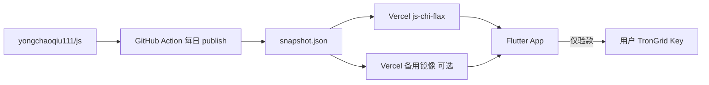

# 排单快照 · 一期（Vercel）→ 二期（WSS）升级指南

> **当前版本（一期）**：App 优先拉 [GitHub js 仓](https://github.com/yongchaoqiu111/js) 发布的 Vercel 静态 `snapshot.json`；用户 TronGrid Key **仅用于本人付款验款**。  
> **二期**：同一 JSON 结构改由 **当前 WSS 节点** 提供，Vercel 作备份 CDN。

---

## 1. 一期架构（现已上线）



| 组件 | 仓库 / 地址 |
|------|-------------|
| 算法 + 发布脚本 | https://github.com/yongchaoqiu111/js |
| 默认快照 CDN | `https://js-chi-flax.vercel.app` |
| Flutter 客户端 | https://github.com/yongchaoqiu111/Client-flutter |

### App 业务规则（一期冻结）

| 功能 | 需要用户 TronGrid Key |
|------|----------------------|
| 看各档池、今日匹配、全队积压 | ❌ |
| 看「我的排单」（快照筛地址） | ❌ |
| 付出场池（钱包广播） | 付款本身用钱包；**验款须 Key** |
| 刷新链上验款 | ✅ |
| 快照失败时本地全量回放 | ✅ |

代码入口：`lib/config/pool_data_policy.dart`

---

## 2. 编译参数（一期）

```bash
# 单 CDN（默认已内置 js-chi-flax，可覆盖）
flutter build apk --dart-define=POOL_SNAPSHOT_URL=https://js-chi-flax.vercel.app

# 多 V 分流（逗号分隔，内容与 GitHub 同源）
flutter build apk \
  --dart-define=POOL_SNAPSHOT_URL=https://js-chi-flax.vercel.app \
  --dart-define=POOL_SNAPSHOT_URLS=https://js-backup.vercel.app,https://js-asia.vercel.app
```

---

## 3. 二期升级做什么

### 3.1 服务端（WSS-server）

- [ ] Leader 跑 `publish-pool-snapshot.js`（或调用 js 仓同款脚本）
- [ ] Raft 命令 `SET_POOL_SNAPSHOT` 写入各节点
- [ ] 暴露只读 API：
  - `GET /api/pool/snapshot` — 与 `public/snapshot.json` **同结构**
  - `GET /api/pool/snapshot/manifest` — 元数据

### 3.2 算法同步

js 仓 `algorithm/` 变更后，同步到 WSS-server `shared/`（或子模块引用同一仓库）。

### 3.3 Flutter 改动清单

| 文件 | 二期改动 |
|------|----------|
| `lib/config/pool_snapshot_config.dart` | 增加 `wssSnapshotPath`；URL 优先级：当前节点 → Vercel 列表 |
| `lib/services/pool_remote_snapshot_service.dart` | `fetchFromWss(RaftApiService)` + 多节点 `contentHash` 交叉校验 |
| `lib/services/pool_matcher_service.dart` | `runMatcher` 源顺序：WSS → Vercel → 本地 TronGrid |
| `lib/config/pool_data_policy.dart` | 补充 WSS 多节点一致性说明 |

**伪代码（二期 `runMatcher` 优先级）：**

```dart
// 1. 当前 WSS 节点
final wss = await PoolRemoteSnapshotService.fetchFromNode(api);
if (wss != null) return wss;

// 2. Vercel 镜像（一期保留作备份）
final cdn = await PoolRemoteSnapshotService.fetchPublished();
if (cdn != null) return cdn;

// 3. 用户 Key 本地回放（与一期相同）
return runFullMatcher();
```

### 3.4 多节点校验（建议二期一起做）

```
从 node A、B 拉 snapshot.contentHash
不一致 → 提示换节点或本地重算
一致   → 使用
```

### 3.5 Vercel 是否下线

**建议保留**：GitHub Action 继续每日 publish → 多 V 镜像；WSS 挂了 App 仍可读 CDN。

---

## 4. 二期验收清单

- [ ] 三节点 `contentHash` 一致
- [ ] App 连 node1/2/3 拉到的 `matchDayId`、`pools` 相同
- [ ] 断 node1 后 App 自动 fallback Vercel
- [ ] 无 Key 仍可看大盘；验款仍须 Key
- [ ] `POOL_SNAPSHOT_URL` 仍可单独发版（仅 CDN 模式）

---

## 5. 相关文档

| 文档 | 说明 |
|------|------|
| [pool-snapshot-server-zh.md](./pool-snapshot-server-zh.md) | 多 WSS + 快照 API 设计 |
| [pool-v4-algorithm-zh.md](./pool-v4-algorithm-zh.md) | pool-v4 算法 |
| js 仓 README | Vercel 部署与 GitHub Secrets |

---

## 6. 版本说明

**当前一期结论**：Vercel + GitHub js 足够内测至数万 DAU；用户 Key 门禁已按「看队免 Key、验款要 Key」实现。二期在 **不改变 JSON 结构** 前提下切换主源到 WSS 即可。
