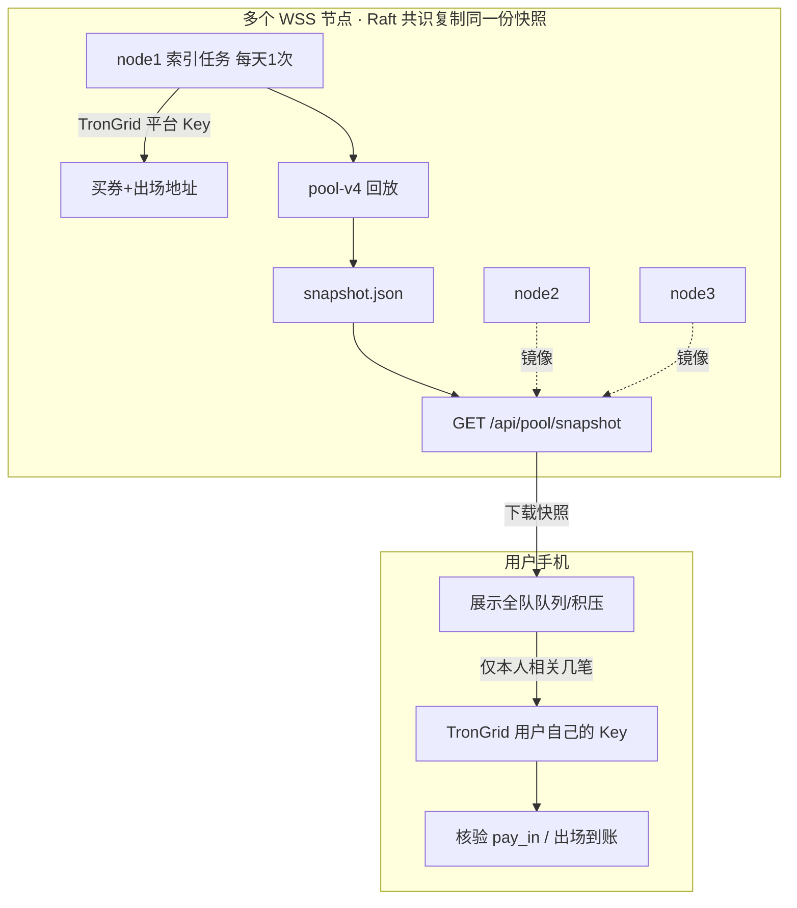

# 排单快照 · 服务器发布 + 客户端自备 Key 核验

> **定位**：不是回到「中心算账」，而是 **索引服务器只发只读 JSON**；涉及本人付款/收款仍用 **用户自己的 TronGrid API Key** 对链。  
> **状态**：已实现 · 见 `WSS-server/shared/publish-pool-snapshot.js` + `pool-snapshot-site/`

---

## 1. 为什么现在就可以做（不必等百万）

| 纯客户端各拉 TronGrid | 纯中心服务器算账 | **本方案（推荐）** |
|----------------------|------------------|-------------------|
| 人少可行，人多易爆 API | 简单但有篡改/信任风险 | 服务器只 **发布快照**，不算用户私账 |
| 无服务器叙事 | 违背无服务器 | **规则仍公开**，快照可验签、可重算 |

你现在已有：`node1` 发 `pool_checkpoint`、客户端 `PoolSnapshotStore`、pool-v4 回放。  
**加一层「每日 pool 快照 API」** 是自然延伸，不是推倒重来。

---

## 2. 整体架构



**分工：**

| 谁 | 干什么 |
|----|--------|
| **服务器（1 次/天或每次匹配后）** | TronGrid 拉公共地址 → 回放 → 写 `snapshot` → 多节点只读提供 |
| **用户手机** | 下快照看「大盘」；**自己的 Key** 只查本人买券/出场几笔做 **核验** |

---

## 3. 多服务器怎么做

利用现有 **Raft 集群**（node1/2/3），不必新开一套：

1. **只有 node1 leader** 跑索引任务（与 `CHECKPOINT_PUBLISHER` 同类）
2. 新命令 `SET_POOL_SNAPSHOT` → 写入 Raft → **各节点数据一致**
3. 客户端从 **当前选的节点** 或 **节点列表轮询** `GET /api/pool/snapshot`
4. 可选第二源：同一份 JSON 同步到 **GitHub Release**（防单点、可审计）

客户端校验多节点一致性：

```
从 node A、B 拉 snapshot.contentHash
不一致 → 提示「节点快照冲突，请换节点或全量本地重算」
一致   → 使用
```

---

## 4. API 约定（草案）

### `GET /api/pool/snapshot`

```json
{
  "ok": true,
  "rulesVersion": "pool-v4-dual-pool",
  "matchDayId": "2026-06-05",
  "publishedAt": 1717564800000,
  "publisherNode": "node1",
  "checkpointBlock": 61234567,
  "contentHash": "sha256:…",
  "signature": "可选，平台私钥签名",
  "pools": {
    "1000": { "snapshot": { … }, "summary": { "payPending": 3, "recvBacklog": 12 } }
  }
}
```

### `GET /api/pool/snapshot/manifest`

仅元数据（版本、hash、发布时间），供 App 判断要不要重新下载。

---

## 5. 客户端行为（改后）

| 功能 | 数据来源 | 要不要用户 API Key |
|------|----------|-------------------|
| 看各档池满不满、今日匹配、全队积压 | **服务器快照** | ❌ 不需要 |
| 看「我的排单」状态（列表） | 快照里筛本人地址 | ❌ 不需要 |
| **确认我是否已付出场池** | 用户 Key 查出场池 **几笔** | ✅ **必须** |
| **一键付出场池** 后验款 | 用户 Key | ✅ **必须** |
| 不信任快照 / 快照过期 | 用户 Key **全量本地重算**（现有逻辑） | ✅ |

**排单 Tab 门禁调整（建议）：**

- 进入排单看大盘：**可不强制 Key**（只读快照）
- 付款、验款、刷新「我的到账」：**强制 Key**（与现设置页一致）

---

## 6. 安全：黑客改 JSON 怎么办

| 威胁 | 对策 |
|------|------|
| 改快照让我以为已付款 | **付款以链上为准**；App 用用户 Key 查本人 `pay_in` 对应 tx，对不上就报警 |
| 改排队顺序骗我 | 快照带 `contentHash`；可选 **平台签名**；多节点 hash 必须一致 |
| 伪造服务器 | 节点列表内置 + TLS；长期可 **GitHub 固定 Release 公钥验签** |
| 内部人作恶 | 任何人可用 **同一 rules + TronGrid** 重算 hash 举报；规则开源 |

**原则（写进产品）：**

> 快照用于 **看队**；**付钱、收钱认链**，用户 Key 抽检本人相关 tx。

---

## 7. 服务器压力有多大

| 项目 | 量级 |
|------|------|
| TronGrid | 每天 **1 次** × 几个公共地址（4 档买券 + 1 出场池 ≈  handful 请求） |
| 回放 CPU | node1 跑 **几秒～几分钟**（视历史笔数） |
| 用户请求 | 每人 **1 次 GET** JSON（几百 KB～几 MB），CDN/网关轻松 |
| Raft 存储 | 每日一条快照记录（可只保留最近 N 天） |

**不是**百万用户算账后台，是 **一个日报生成器 + 静态 JSON 分发**。

---

## 8. 实施分期（确认后动代码）

### 一期（最小可用）

- [ ] `publish-pool-snapshot.js`：平台 TronGrid Key + pool-rules 回放
- [ ] `SET_POOL_SNAPSHOT` + `GET /api/pool/snapshot`
- [ ] App：`PoolMatcherService` **优先拉服务器快照**，失败回退本地全量
- [ ] App：「我的」相关状态 **用户 Key 核验** exit pool

### 二期

- [ ] 多节点 `contentHash` 交叉校验
- [ ] 快照 **Ed25519 签名** + App 内置公钥
- [ ] GitHub 镜像同一份 JSON

### 三期

- [ ] 匹配后自动发布（不仅每日一次）
- [ ] 运营看板直接读 manifest

---

## 9. 和现有功能的关系

| 现有 | 升级后 |
|------|--------|
| 用户各自 TronGrid 全量拉 | 默认 **下快照**；核验/付款仍用用户 Key |
| `pool_checkpoint` 块高 | 快照里带上，截断一致 |
| 强制 Key 才能进排单 | 建议改为 **付款/验款强制 Key**，看队不强制 |
| Raft 关系网 | **仍可不做了**（服务中心网方案不变） |

---

## 10. 请你拍板 4 件事（确认后开发）

1. **快照发布频率**：每天 08:00 匹配后一次，还是每小时增量？  
2. **排单门禁**：改为「看队免 Key / 付款要 Key」是否同意？  
3. **多节点**：先 Raft 镜像，要不要同时发 GitHub？  
4. **一期是否做签名**：先只做 `contentHash`，还是连签名一起做？

---

*pool-snapshot-server v0 · 待确认*
