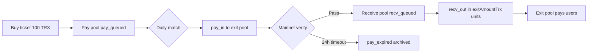

# Serverless Queue Matching Algorithm · pool-v4-dual-pool (English)

> **Rules version**: `pool-v4-dual-pool`  
> **Reference implementation (this repo)**: [`lib/services/pool_engine_service.dart`](../lib/services/pool_engine_service.dart), [`lib/config/pool_rules_config.dart`](../lib/config/pool_rules_config.dart), [`lib/services/exit_pay_verify.dart`](../lib/services/exit_pay_verify.dart)  
> **Chinese version**: [pool-v4-algorithm-zh.md](./pool-v4-algorithm-zh.md)

---

## 1. Design goals

This algorithm powers **Scheme A: serverless queue matching**. Any participant can reproduce the same queue, match, and payment-verification results using only public rules and on-chain data—in the app or in a standalone script.

| Principle | Description |
|-----------|-------------|
| Publicly verifiable | Rules and engine source live in this repository; anyone can replay |
| On-chain truth | Ticket purchases and exit-pool payments are verified via TronGrid mainnet txs |
| No user self-report | No testnet anchors; “I have paid” means refresh TronGrid only |
| Dual pools | **Pay pool** and **receive pool** are separate; buying a ticket ≠ becoming a receiver |
| Incremental replay | Completed / expired / blocked entries are archived in snapshots to avoid full-history recomputation |

---

## 2. Core concepts

### 2.1 Dual-pool model



- **Pay pool**: After buying a ticket, users wait to be selected to fund the overflow portion of the daily match.
- **Exit pool**: A fixed mainnet collection address that receives pay-pool outflows; after verification, the payer enters the receive pool.
- **Receive pool**: Verified users queue for exit payouts in whole **`exitAmountTrx`** units (e.g. 3,900 TRX on the 3000 tier).

### 2.2 Buying a ticket ≠ being a receiver

Paying `ticketPriceTrx` (e.g. 100 TRX) to `purchaseAddress` only credits `poolCreditTrx` (e.g. 3,000) into the pool ledger. It does **not** make the user a receiver. The user must complete exit-pool payment and pass mainnet verification first.

### 2.3 Exit pool address

All three tiers share this default mainnet exit pool (`PoolRulesConfig.defaultExitPoolAddress`):

```
TRjvctzrc5WcEeu2UrT8mV5H6zW8dCgimR
```

---

## 3. Tier configuration (aligned with legacy queue profit rates)

**Same algorithm**; each tier is an independent pool with different parameters. See `kPoolTiers` in `lib/config/pool_rules_config.dart`.

| Tier | Entry pay | Pool credit | Pool target | Exit | Profit |
|------|-----------|-------------|-------------|------|--------|
| Small | 100 | 1,000 | 100,000 | 1,300 | 30% |
| Medium | 1,000 | 10,000 | 1,000,000 | 12,000 | 20% |
| Large | 5,000 | 100,000 | 10,000,000 | 110,000 | 10% |
| Super | 50,000 | 1,000,000 | 100,000,000 | 1,080,000 | 8% |

Pool target = `poolCreditTrx × 100` (same “100 entries fill the pool” structure as before).

---

## 4. Global constants

Defined in `PoolRulesConfig`:

| Constant | Value | Description |
|----------|-------|-------------|
| `entryPeriodDays` | 15 | Must wait 15 days after first valid ticket before matching |
| `matchPaymentTimeoutHours` | 24 | Deadline for pay_in exit-pool payment |
| `maxOpenEntriesPerPayer` | 1 | At most one open entry per payer address |
| `dailyMatchUtcHour` | 0 | Daily match at UTC 00:00 (Beijing 08:00) |
| `matchesPerDay` | 1 | Exactly one match per calendar day |

---

## 5. Entry state machine

| Status | Pool | Meaning |
|--------|------|---------|
| `pay_queued` | Pay | Ticket bought; waiting to be selected as payer |
| `pay_pending` | Pay | pay_in task issued; must pay exit pool |
| `pay_expired` | Archived | Exit payment timed out |
| `recv_queued` | Receive | Mainnet verification passed; waiting for recv_out |
| `recv_partial` | Receive | Remainder not yet reaching exitAmount; carries to next day |
| `recv_pending` | Receive | Full exit slot allocated; awaiting on-chain receipt |
| `done` | Archived | Exit completed |
| `blocked` | Archived | Violation (e.g. duplicate open entry) |
| `consumed` | Archived | Credit consumed |

**Frozen statuses** (no rollback): `pay_pending`, `pay_expired`, `recv_*`, `done`, `consumed`, `blocked`.

---

## 6. Inputs

The replay engine `PoolEngineService.runPoolCycle` requires:

1. **`purchaseTxs`**: Transfers to `purchaseAddress` with amount equal to `ticketPriceTrx`.
2. **`exitPoolTxs`**: Transfers to `exitPoolAddress` with amount **not** equal to the ticket price.
3. **`snapshot`** (optional): Previous checkpoint for incremental replay.
4. **`nowMs`**: Wall-clock evaluation time (verification window and expiry).

Deterministic tx ordering:

```
blockNumber ↑ → blockTimestamp ↑ → txHash lexicographic ↑
```

Address comparison must normalize Base58 (`T…`) and hex (`41…`) forms; see `lib/utils/tron_address_util.dart`.

---

## 7. Ledger and match eligibility

### 7.1 Pool credit ledger

```
ledgerBalance = Σ(poolCreditTrx of entries not in blocked/pay_expired/done)
              − Σ(historical matchedCreditTrx)
```

### 7.2 Can match today (`canMatch`)

All of the following must hold:

1. `ledgerBalance >= poolTargetTrx` (pool full)
2. At least `entryPeriodDays` since the first valid entry
3. `overflow = ledgerBalance − poolTargetTrx > 0` (only overflow is matched)

The target amount (e.g. 300,000) is **not** consumed by matching; only overflow is deployed.

---

## 8. Daily match algorithm (UTC 00:00)

For each match day `dayStartMs`, execute in order:

### Step 1 — Merge ticket purchases

- Full replay: all purchases with `blockTimestamp <= dayStartMs`.
- Incremental replay: only new purchases with `snapshotAtMs < blockTimestamp <= dayStartMs`.

### Step 2 — Lifecycle (one open entry per payer)

If a `payer` already has an open entry, subsequent tickets are marked `blocked` with reason: `一次只能排一单` (one queue entry at a time).

### Step 3 — Mainnet payment verification

For `pay_pending` entries, verify against `exitPoolTxs` within `[matchAtMs, evaluationMs]`:

- All pay_in tasks matched → `recv_queued`, store `verifiedMainnetTxId`
- Past `deadlineMs` without full payment → `pay_expired`

See Section 9 for verification rules.

### Step 4 — If `canMatch`, produce match output

#### 8.1 Select payers (from tail of pay pool)

From `pay_queued`, walk **backward** from the tail, accumulating `remainingPoolCreditTrx` until sum ≥ `overflow`.

Selected payers receive **pay_in** tasks:

```
assignmentId = pay_{matchDayId}_{entryId}
channel      = pay_in
amountTrx    = payer's available credit
collector    = exitPoolAddress
deadlineMs   = matchAtMs + 24h
```

Corresponding entries → `pay_pending`.

#### 8.2 Receive pool allocation (recv_out)

Apply `overflow` to `recv_partial` carryovers first, then allocate whole `exitAmountTrx` slots to the front of `recv_queued`:

| Case | Handling |
|------|----------|
| Full exitAmount slot | `recv_pending` |
| Remainder to next receiver | `recv_partial`, store `exitRemainderTrx` |
| Remainder with no receiver | Refund to `purchaseAddress` (`ticket_surplus`) |

#### 8.3 Accounting

```
matchedCreditTrx = Σ(pay_in.amountTrx) + Σ(ticket_surplus.amountTrx)
```

Append a summary to `matchDays` for ledger deduction on later days.

---

## 9. Exit-pool mainnet verification

Function: `ExitPayVerify.derivePayVerifications(...)`

For all pay_in tasks of the same `payerEntryId`:

| Criterion | Requirement |
|-----------|-------------|
| From address | `fromAddress` = task `payer` |
| To address | `toAddress` = `exitPoolAddress` (when present on-chain) |
| Amount | Equals `amountTrx` (4 decimal places) |
| Time | `matchAtMs <= blockTimestamp <= evaluationMs` |
| Dedup | Each on-chain tx used at most once globally |

All tasks matched → verified; any deadline passed without full payment → `pay_expired`.

**Do not use** testnet, user-submitted tx hashes, or WSS push as verification sources.

---

## 10. Checkpoint snapshots (incremental replay)

Implementation: `lib/services/pool_snapshot.dart` (codec), `lib/services/pool_snapshot_store.dart` (local persistence).

Archived statuses: `done`, `pay_expired`, `blocked` are omitted from `activeEntries`; `blockedPayers` is retained.

Snapshot fields:

- `rulesVersion`, `poolId`, `snapshotAtMs`
- `activeEntries`, `matchDays`
- `blockedPayers`, `usedExitTxIds`, `lastQueueIndex`

Incremental replay:

- Fetch only purchases after `snapshotAtMs`
- Resume match loop from `lastMatchDayMs + 1 day`
- Complexity ≈ O(new days + new entries), not O(full history)

---

## 11. API entry points

```dart
import 'package:mmm_client/services/pool_engine_service.dart';

final engine = PoolEngineService();
final result = engine.runPoolCycle(
  poolId: '1000',
  purchaseTxs: purchaseTxs,
  exitPoolTxs: exitPoolTxs,
  snapshot: savedSnapshot, // optional
  nowMs: DateTime.now().millisecondsSinceEpoch,
);
```

In the app, `PoolMatcherService.runFullMatcher()` fetches TronGrid data and persists `result.snapshot`.

Key outputs:

| Field | Meaning |
|-------|---------|
| `entries` | All active entries |
| `fill` | Fill ratio, overflow, canMatch |
| `payAssignments` | Today's pay_in tasks |
| `recvAssignments` | Today's recv_out tasks |
| `exitPoolAddress` | Exit pool address |
| `snapshot` | New checkpoint |
| `replayMode` | `full` or `incremental` |

---

## 12. Determinism guarantee

Two parties obtain **identical** `entries`, `payAssignments`, and `recvAssignments` if:

1. Same `PoolRulesConfig.rulesVersion`
2. Same purchase + exit-pool tx sets (including pagination completeness and address normalization)
3. Same `nowMs` and starting `snapshot`

This property is why the algorithm is safe to publish on GitHub.

---

## 13. Module index (this repository)

| Module | Path | Role |
|--------|------|------|
| Rule constants | `lib/config/pool_rules_config.dart` | Version, tiers, match schedule |
| Replay engine | `lib/services/pool_engine_service.dart` | Dual-pool replay, daily match |
| Exit verification | `lib/services/exit_pay_verify.dart` | pay_in mainnet pairing |
| Snapshot codec | `lib/services/pool_snapshot.dart` | Checkpoint export/load |
| Snapshot storage | `lib/services/pool_snapshot_store.dart` | SharedPreferences |
| TronGrid | `lib/services/pool_matcher_service.dart` | On-chain fetch + replay |
| Address normalize | `lib/utils/tron_address_util.dart` | Base58 / hex compare |
| Models | `lib/models/pool_cycle_models.dart` | Entry, Assignment, etc. |
| UI | `lib/screens/pool_queue_screen.dart` | In-app queue screen |

The rules version string must match `PoolRulesConfig.rulesVersion`; otherwise discard old snapshots and run a full replay.

---

*This document tracks the `pool-v4-dual-pool` rules. If ambiguous, `lib/services/pool_engine_service.dart` is authoritative.*
