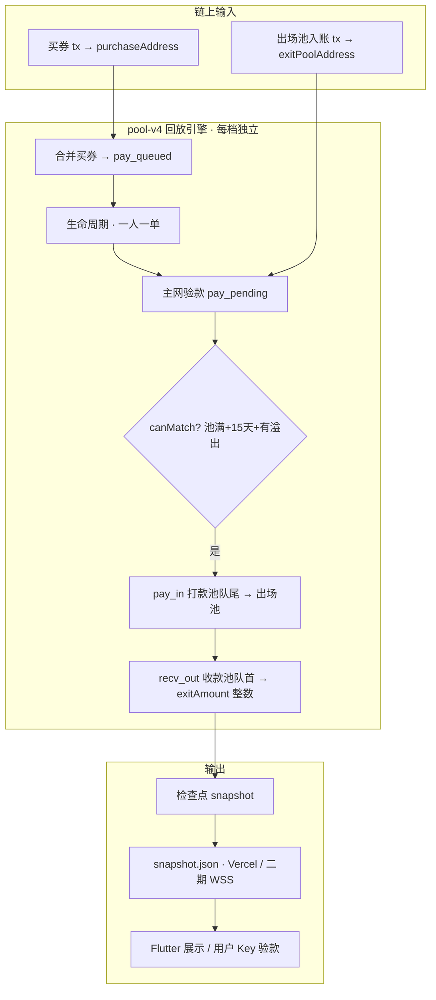

# pool-v4 排单算法 · 开发总览（最新）

> **规则版本**：`pool-v4-dual-pool`  
> **更新日期**：2026-06  
> **说明**：本文是 **开发文档入口**；细节以源码与下表分册为准。

---

## 1. 文档在哪里看？

| 文档 | 路径 | 适合谁 |
|------|------|--------|
| **本文（总览）** | [pool-v4-dev-master-zh.md](./pool-v4-dev-master-zh.md) | 开发、产品、对接 |
| **算法完整说明** | [pool-v4-algorithm-zh.md](./pool-v4-algorithm-zh.md) | 匹配逻辑、状态机、验款 |
| **英文版** | [pool-v4-algorithm-en.md](./pool-v4-algorithm-en.md) | 对外 / 审计 |
| **快照发布（一期 Vercel）** | [pool-snapshot-phase2-upgrade-zh.md](./pool-snapshot-phase2-upgrade-zh.md) | 运维、发版 |
| **快照服务器（二期 WSS）** | [pool-snapshot-server-zh.md](./pool-snapshot-server-zh.md) | 后端、多节点 |
| **百万运营 / 护盘** | [million-member-ops-playbook-zh.md](./million-member-ops-playbook-zh.md) | 运营 |
| **发展路线图** | [stable-growth-roadmap-zh.md](./stable-growth-roadmap-zh.md) | 战略、转单链业务 |
| **内测上线门闩** | [beta-and-launch-checklist-zh.md](./beta-and-launch-checklist-zh.md) | 发版验收 |
| **js 快照仓 README** | https://github.com/yongchaoqiu111/js | Action、Vercel |

**权威源码（三处须同步）**：

| 仓库 | 路径 |
|------|------|
| Flutter 客户端 | `Client-flutter/lib/services/pool_engine_service.dart` |
| Flutter 客户端 | `Client-flutter/lib/config/pool_rules_config.dart` |
| GitHub 快照仓 | `yongchaoqiu111/js/algorithm/pool-rules.js` |
| WSS 服务端 | `WSS-server/shared/pool-rules.js`（与 js 仓对齐） |

---

## 2. 档位：当前是几档？

**当前代码实现为 4 档**（非 6 档）。排单商城与链上排单 **同一套出场比例**，算法相同、仅参数不同。

| # | 档位 ID | 名称 | 进场实付 (TRX) | 入池额度 | 池满阈值 | 出场额 | 收益率 |
|---|---------|------|----------------|----------|----------|--------|--------|
| 1 | `1000` | 小额排单 | 100 | 1,000 | 100,000 | 1,300 | 30% |
| 2 | `10000` | 中额排单 | 1,000 | 10,000 | 1,000,000 | 12,000 | 20% |
| 3 | `100000` | 大额排单 | 5,000 | 100,000 | 10,000,000 | 110,000 | 10% |
| 4 | `1000000` | 超大额排单 | 50,000 | 1,000,000 | 100,000,000 | 1,080,000 | 8% |

- 池满阈值 = `poolCreditTrx × 100`（约 100 笔买券满池）
- 各档 **独立资金池**，互不影响
- 出场池地址各档默认共用：`TRjvctzrc5WcEeu2UrT8mV5H6zW8dCgimR`

配置定义位置：

- Flutter：`lib/config/pool_rules_config.dart` → `kPoolTiers`
- 排单商城展示：`lib/config/queue_tiers_presets.dart`（4 档，`ticketCost` 为排单券张数）
- JS：`algorithm/pool-config.js` → `POOL_PURCHASE_CONFIG`
- WSS：`shared/queue-rules.js` → `QUEUE_TIERS`

> 若业务上规划「6 档」，**尚未写入代码**；扩档需同时改上述 4 处 + GitHub Secrets 池地址 + 文档。

---

## 3. 架构一图



---

## 4. 双池模型（核心）

| 池 | 作用 | 关键状态 |
|----|------|----------|
| **打款池** | 买券排队，被选中去 **付** 出场池 | `pay_queued` → `pay_pending` |
| **出场池** | 固定主网地址，承接 pay_in 汇款 | 链上验款依据 |
| **收款池** | 验款通过后排队 **收** 出场款 | `recv_queued` → `recv_pending` → `done` |

**铁律**：买券 ≠ 收款人。必须先 pay_in 付清出场池并经主网验款，才进收款池。

---

## 5. 匹配算法（每日一次）

**匹配时刻**：UTC 0:00（北京 08:00），`matchesPerDay = 1`。

### 5.1 可否今日匹配 `canMatch`

须 **同时** 满足：

1. `ledgerBalance >= poolTargetTrx`（池满）
2. 距首笔有效买券 ≥ `entryPeriodDays`（15 天）
3. `overflow = ledgerBalance - poolTargetTrx > 0`

只匹配 **溢出部分**，目标池额本身不被消耗。

### 5.2 每日循环步骤

```
对每个 matchDay（从首单日起，步长 1 天）:
  1. 合并买券 tx（checkpoint 前全量 / 快照后增量）
  2. applyLifecycle：同一 payer 仅 1 笔开放单，其余 blocked
  3. 主网验款：pay_pending + exitPoolTxs → recv_queued 或超时处理
  4. 若 canMatch：
     4a. 打款池队尾向前累加 remainingCredit ≥ overflow → 生成 pay_in
     4b. 收款池队首按 exitAmountTrx 整数分配 recv_out
     4c. 零头 recv_partial 次日继续；无法分配则 ticket_surplus 打回买券地址
  5. 记账 matchedCreditTrx，写入 matchDays
```

### 5.3 打款方选取（pay_in）

- 从 `pay_queued` **队尾向前**累加 `remainingPoolCreditTrx`
- 直到总和 ≥ `overflow`
- 每人最多拆 `maxSplitsPerPayer`（3）笔
- `assignmentId = pay_{matchDayId}_{entryId}`
- `deadlineMs = matchAtMs + 24h`
- `collector = exitPoolAddress`

### 5.4 收款方分配（recv_out）

- 溢出先补 `recv_partial` 零头
- 再按 `exitAmountTrx` 整数给 `recv_queued` 队首
- 满额 → `recv_pending`；不足 → `recv_partial` + `exitRemainderTrx`

### 5.5 交易排序（确定性）

```
blockNumber ↑ → blockTimestamp ↑ → txHash 字典序 ↑
```

任意两方相同输入 + 相同 `rulesVersion` + 相同 `snapshot` + 相同 `nowMs` → 输出 **完全一致**。

---

## 6. 主网验款规则

实现：`exit-pay-verify.js` / `lib/services/exit_pay_verify.dart`

| 条件 | 要求 |
|------|------|
| 付款地址 | `fromAddress` = 任务当前 `payer`（**谁付谁收**） |
| 收款地址 | `toAddress` = `exitPoolAddress` |
| 金额 | 与 `amountTrx` 一致（4 位小数） |
| 时间窗 | `matchAtMs ≤ blockTimestamp ≤ evaluationMs` |
| 去重 | 每笔链上 tx 全局仅用一次 |

**不使用**：测试网 anchor、用户手填 txHash、WSS 推送作为验款依据。

---

## 7. 付款转单链（文档有 · 引擎待补）

[stable-growth-roadmap-zh.md §14.8](./stable-growth-roadmap-zh.md) 与 [pool-v4-algorithm-zh.md §8 步骤3补充](./pool-v4-algorithm-zh.md) 描述了 **L0 会员 → L1 上级 → L2 服务中心 → L3 平台**，每级 24h。

**当前 `pool-rules.js` / `pool_engine_service.dart` 尚未实现 `payerLevel` / `timeout_transferred` 转单**；超时 presently 倾向直接 `pay_expired`。二期若要上线转单链，须先改引擎再改文档标注。

---

## 8. 数据流与 App 分工（一期）

| 角色 | 做什么 |
|------|--------|
| **GitHub js + Action** | 平台 TronGrid Key 索引 → `publish-pool-snapshot.js` → `snapshot.json` |
| **Vercel CDN** | 静态分发 `/snapshot.json`（多 V 镜像同源） |
| **Flutter 看大盘** | `PoolRemoteSnapshotService` 拉快照，**无需**用户 Key |
| **Flutter 验本人款** | 用户 TronGrid Key + `runChainVerify()` |
| **二期 WSS** | 各节点 `GET /api/pool/snapshot`，`contentHash` 交叉校验 |

门禁说明：`lib/config/pool_data_policy.dart`

---

## 9. 状态机速查

| 状态 | 池 | 含义 |
|------|-----|------|
| `pay_queued` | 打款 | 买券成功，排队 |
| `pay_pending` | 打款 | 已生成 pay_in，待付出场池 |
| `pay_expired` | 归档 | 超时未付清 |
| `recv_queued` | 收款 | 验款通过，排队收款 |
| `recv_partial` | 收款 | 零头未凑满 exitAmount |
| `recv_pending` | 收款 | 已分配完整出场额 |
| `done` | 归档 | 出场完成 |
| `blocked` | 归档 | 违反一人一单等 |
| `consumed` | 归档 | 额度已消耗 |

---

## 10. 全局常量

| 常量 | 值 | 定义位置 |
|------|-----|----------|
| `rulesVersion` | `pool-v4-dual-pool` | `PoolRulesConfig` / `pool-config.js` |
| `entryPeriodDays` | 15 | 同上 |
| `exitPeriodDays` | 7 | 同上 |
| `matchPaymentTimeoutHours` | 24 | 同上 |
| `maxOpenEntriesPerPayer` | 1 | 同上 |
| `maxSplitsPerPayer` | 3 | 同上 |
| `dailyMatchUtcHour` | 0 | 同上 |
| `poolTargetMultiplier` | 100 | 同上 |

---

## 11. 本地跑通 / 调试

### 11.1 Flutter

```bash
cd Client-flutter
flutter pub get
flutter run --dart-define=POOL_SNAPSHOT_URL=https://js-chi-flax.vercel.app
```

### 11.2 快照仓发布（需真实 Secrets）

```bash
cd mmm-pool-snapshot   # 或 clone yongchaoqiu111/js
cp .env.example .env   # 填 TRONGRID_API_KEY 与池地址
npm install
npm run publish
```

### 11.3 对照测试

- WSS：`WSS-server/shared/test-tier-profit-simulation.js`
- WSS：`WSS-server/shared/test-community-growth-simulation.js`

---

## 12. 改算法时的检查清单

- [ ] `pool-rules.js`（js 仓 + WSS-server）
- [ ] `pool-config.js` 档位参数
- [ ] `pool_engine_service.dart` + `pool_rules_config.dart`
- [ ] `exit-pay-verify.js` / `exit_pay_verify.dart`
- [ ] `publish-pool-snapshot.js`
- [ ] `pool-v4-algorithm-zh.md` + **本文**
- [ ] GitHub Action Secrets 池地址
- [ ] Flutter `POOL_SNAPSHOT_URL` 发版参数
- [ ] 跑 simulation 测试 + 对比 `contentHash`

---

## 13. 常见问题

**Q：为什么是 4 档不是 6 档？**  
A：当前 `kPoolTiers` / `POOL_PURCHASE_CONFIG` / `QUEUE_TIERS` 均为 4 项。扩档需全链路改配置。

**Q：匹配算法以哪为准？**  
A：以 `pool-rules.js` 与 `pool_engine_service.dart` 行为一致为准；文档描述转单链处若与代码不符，以代码为准并记为待实现项（见 §7）。

**Q：用户要不要 TronGrid Key？**  
A：看大盘不要；验本人付款、本地回放要。见 `pool_data_policy.dart`。

---

*维护：算法变更时同步更新 [pool-v4-algorithm-zh.md](./pool-v4-algorithm-zh.md) 与本文 §2、§5、§7。*
