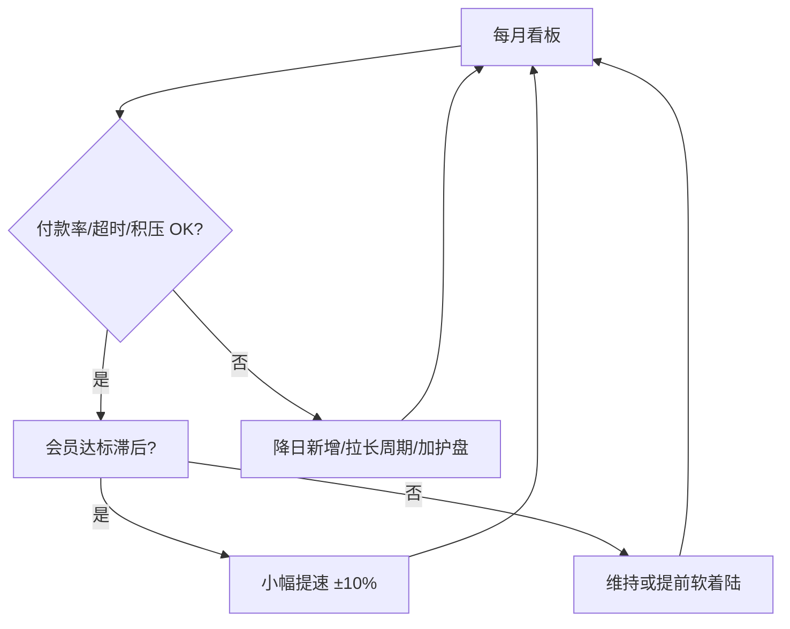
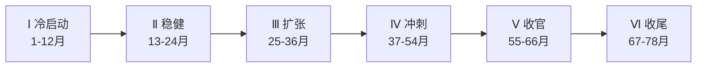
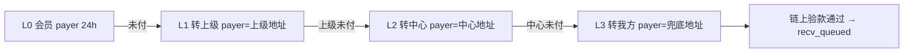

# 最稳信心路线 · 动态发展沙盘

> **版本**：v2-dynamic（基数可调，非死板指标）  
> **推演脚本**：`WSS-server/shared/test-stable-roadmap-simulation.js`  
> **算法依据**：[pool-v4-algorithm-zh.md](./pool-v4-algorithm-zh.md)  
> **每日执行**：[百万会员运营手册](./million-member-ops-playbook-zh.md)（护盘排单数 · 提速 · 放缓 · 怎么看指标）  
> **内测上线**：[内测与上线门闩](./beta-and-launch-checklist-zh.md)

---

## 0. 计划怎么读（最重要）

**本文所有数字都是「当前基准大约数」，不是写死的 KPI。**

一切调整服从两个前提（不可妥协）：

| 优先级 | 前提 | 含义 |
|--------|------|------|
| **P0** | **达会员数** | 按阶段推进真实会员规模（允许时间顺延，不允许虚假刷单） |
| **P0** | **不崩盘** | `pay_expired`、收款积压、付款率恶化时 **立刻降速**，宁可慢不可炸 |

在此之上，门票收入、我方护盘比例、人均轮次、四桶比例、是否转商城——**都可以按月复盘后调整**。



---

## 1. 当前基准目标（可调）

| 项目 | 当前基准 | 可调范围 |
|------|----------|----------|
| 启动会员 | 100 人 | — |
| 会员目标 | **100 万** | 目标不变，**月份可顺延**（如 66→72 月） |
| 起始资金池 | 30 万满池线 | 后期可升档，需公示 |
| 日新增硬顶 | 见阶段表 | 每月 ±10%，遇红线 **减半或归零** |
| 我方护盘体量 | 约 30% 门票 | **20–40%** 随信心调节 |
| 门票收入大约 | 约 3 亿（人均 3 轮） | 随轮次/人数浮动，**不强行凑数** |
| 转商城时机 | 百万后 + 积压可控 | 积压 >15% 则 **延后**，先清队 |

**操作原则**：慢增长、高付款率、周期渐长；**数字服务于信心，不是信心服从数字**。

---

## 2. 六阶段路线图



| 阶段 | 月份 | 会员区间 | 日新增硬顶 | 进场期 | 付款时限 | 付款合规 |
|------|------|----------|------------|--------|----------|----------|
| Ⅰ·冷启动+信心 | 1–12 | 100 → 3,000 | **≤15** | 15天 | 48h | ≥99% |
| Ⅱ·稳健增长 | 13–24 | 3,000 → 20,000 | **≤80** | 30天 | 48h | ≥98.5% |
| Ⅲ·规模扩张 | 25–36 | 20,000 → 100,000 | **≤320** | 45天 | 72h | ≥98% |
| Ⅳ·百万冲刺 | 37–54 | 100,000 → 600,000 | **≤1500** | 60天 | 72h | ≥98% |
| Ⅴ·达标收官 | 55–66 | 600,000 → 1,000,000 | **≤2200** | 60天 | 96h | ≥99% |
| Ⅵ·收尾稳态 | 67–78 | 1,000,000 → 1,020,000 | **≤5** | 60天 | 96h | ≥99% |

> **日新增硬顶**：运营红线，严禁冲量超过当期上限。

---

## 3. 里程碑考核表（允许 ±10%）

| 月份 | 节点 | 会员目标 | 关键验收 |
|------|------|----------|----------|
| 6 | 首轮验证 | 800 | 出场 ≥300，超时率 <0.5% |
| 12 | 一周年 | 3,000 | 出场率 ≥35% |
| 18 | 口碑期 | 8,000 | 付款合规 ≥99% |
| 24 | 两周年 | 20,000 | 超时率 <1% |
| 30 | 规模期 | 50,000 | 进场期 30 天执行 |
| 36 | 三周年 | 100,000 | 付款窗口 72h |
| 42 | 扩张期 | 200,000 | 账本峰值可控 |
| 48 | 加速期 | 350,000 | 无大规模 pay_expired |
| 54 | 冲刺期 | 600,000 | 进场 60 天执行 |
| 60 | 冲刺中段 | 800,000 | 进入阶段Ⅴ |
| **66** | **百万社区** | **1,000,000** | **达标收官** |
| 72 | 收尾消化 | 1,012,000 | 日新增 ≤5 |
| 78 | 稳态运营 | 1,020,000 | 积压持续下降 |

---

## 4. 沙盘推演结果（已验证）

运行：`node shared/test-stable-roadmap-simulation.js`

| 指标 | 推演值 | 判定 |
|------|--------|------|
| 第 66 月会员 | 1,000,000 | ✓ 达标 |
| 付款超时率 | 1.58% | 基本稳定 |
| 收款积压率 | 21.6% | 收尾期消化 |
| 出场完成率 | 76.8% | 正常 |
| 累计匹配轮次 | 2,325 轮 | — |
| 账本峰值 | 约 447 万 TRX | 满池线仍 30 万 |
| 累计进场实付 | 约 1 亿 TRX | 100 TRX/人 |

---

## 5. 资金池怎么「长大」？

| 概念 | 数值 | 说明 |
|------|------|------|
| 满池线（固定） | 30 万 TRX | 不随会员膨胀 |
| 账本峰值 | 约 447 万 TRX | 匹配前瞬时积压 |
| 累计进场实付 | 约 1 亿 TRX | 真实链上收款 |
| 累计入池信用 | 约 30 亿 TRX | 记账单位（3000/人） |

会员越多 → **匹配次数越多**（约 2325 轮），而非把满池线抬高。

---

## 6. 运营红线（必须执行）

1. **付款合规率**：冷启动 ≥99%，全程 ≥98%
2. **日新增**：不得超过当期硬顶（见阶段表）
3. **考核偏差**：里程碑允许 ±10%；连续 2 月滞后则主动降速
4. **不升档**：66 个月内维持 30 万池，避免规则切换动摇信心
5. **收尾**：第 66 月达标后立即进入阶段Ⅵ，日新增 ≤5

---

## 7. 与激进路线对比

| | 激进（12月100万） | **本沙盘（66月100万）** |
|--|-------------------|-------------------------|
| 月增长 | 115% | **10.3%** |
| 日均新增 | 2,778 | **8 → 2,200（分阶段）** |
| 超时风险 | 高 | **低（1.58%）** |
| 运营信心 | 低 | **高** |
| 结论 | 不推荐 | **定稿采用** |

---

## 8. 收尾阶段怎么做？

第 67–78 月（阶段Ⅵ）：

- 日新增 **≤5 人/天**
- 进场期 **60 天**，付款 **96 小时**
- 目标：让约 **21.6%** 收款积压逐步消化
- 不追求会员数再涨，追求 **付款率、出场率、口碑**

---

## 9. 软着陆 · 门票收入大约数与分配（基准参考，可调）

> **不额外集资**；用已收门票理财，**收益**反哺会员。数为大约数，**以链上实收为准**。  
> 推演：`node shared/test-soft-landing-ticket-allocation.js`、`test-soft-landing-with-platform.js`

### 9.1 门票怎么算（22 天一轮 · 出场即复购）

```
1 轮 = 22 天（15 进场 + 7 出场）
每进场 1 次 = 100 TRX 门票（含出场后马上复购）

门票总收入大约 = 100 万会员 × 人均轮次 × 100 TRX
```

| 参考 | 轮次 | 门票大约 |
|------|------|----------|
| 沙盘推演（第 66 月） | 人均 **1.77 轮** | **约 1.8 亿 TRX** |
| **拍板目标 ★** | 人均 **3 轮** | **约 3.0 亿 TRX** |
| 从头老玩家个人 | **约 90 轮** | 约 **9000 TRX/人**（不是全社区人均） |

### 9.2 门票总收入大约数（第 66 月）

```
门票总收入 ≈ 100万 × 人均轮次 × 100 TRX
```

| 档位 | 人均轮次 | 门票收入大约 |
|------|----------|--------------|
| 沙盘推演 | 1.77 轮 | **约 1.8 亿 TRX** |
| **规划参考 ★** | **3 轮** | **约 3.0 亿 TRX** |
| 积极 | 10 轮 | 约 10 亿 TRX |

计算示例：`1,000,000 × 3 × 100 ≈ 3 亿 TRX`。**实收随轮次变化，软着陆按当月链上累计分桶，不强行凑 3 亿。**

### 9.3 四桶分配（中档 3 亿 · 大约数）

| 桶 | 比例 | 大约金额 | 干什么 |
|----|------|----------|--------|
| **L0 运营** | 10% | **约 3000 万 TRX** | 技术、多签、客服 |
| **L1 匹配周转** | 35% | **约 1.05 亿 TRX** | 满池匹配、日常流转 |
| **L2 出场备付** | 35% | **约 1.05 亿 TRX** | 积压出场缓冲 |
| **L3 可理财** | 20% | **约 6000 万 TRX** | 质押/低风险；**只分收益** |

**分红大约数（L3 年化 5%）：**

- 年收益约 **300 万 TRX**
- 百万会员人均约 **3 TRX/年**（约 **0.25 TRX/月**）
- 玩过 **90 轮**的老玩家，按轮次加权约为只玩 **1 轮**者的 **90 倍**

### 9.4 分红规则（不再收钱）

按 **历史进场次数（含复购）** 加权：

```
个人分红份额 ∝ 该会员累计门票张数（链上可查）
```

### 9.5 软着陆三阶段（中档 3 亿）

| 阶段 | 时间 | L3 理财 | 动作 |
|------|------|---------|------|
| Ⅵ 收尾 | 67–78 月 | 约 3000 万（10%） | 日新增≤5，消化积压，理财试点 |
| Ⅶ 过渡 | 79–90 月 | 约 6000 万（20%） | 减匹配，收益 50% 分红 / 50% 再投 |
| Ⅷ 稳态 | 91 月+ | 约 7500万–1亿（25–35%） | 长期分红，门票池封顶 |

### 9.6 我方约 30% 进场护盘

门票体量中约 **30%** 为我方多地址循环进场（护盘、稳信心），约 **70%** 为真实会员。

| 拍板约 3 亿总门票 | 大约金额 | 用途 |
|-------------------|----------|------|
| **我方 30%** | **约 0.9 亿 TRX** | L1/L2 周转备付，**不参与会员分红** |
| **真实会员 70%** | **约 2.1 亿 TRX** | 软着陆底数 + 后续商城反哺资金源 |

我方护盘地址链上可打标签公示；软着陆后期逐步减量，转商城补贴池。

### 9.7 百万后转型：匹配退场 · 商城反哺

| 阶段 | 时间 | 主线 |
|------|------|------|
| Ⅰ 匹配期 | 0–66 月 | 排单匹配 + 22 天循环，门票约 → **3 亿** |
| Ⅱ 软着陆 | 67–90 月 | 停冲量、消化积压、L3 分红试点 |
| **Ⅲ 商城期** | **91 月+** | **不以匹配为主**；商城/权益反哺会员 |

**商城反哺大约来源：**

- 门票 L3 理财收益（约 **200–300 万 TRX/年**，仅对会员 70% 部分分红）
- 商城毛利按比例拨入会员权益池
- 我方护盘资金逐步转为补贴池，不再扩匹配

**反哺形式（示例）：** 历史轮次积分、商城抵扣、老会员优先购；存量 `recv_queued` 用 L2 清完为止。

### 9.8 会员沟通（口径随实收调整）

「达标后，历史门票按链上实收分桶理财；我方护盘保障流动，收益和商城权益按轮次反哺真会员；**不集资、不硬冲**。」

推演：`node shared/test-soft-landing-with-platform.js`

---

## 10. 崩盘红线与自动降速（P0）

出现任一项 → **本月停止提速**，触发项持续 2 月 → **降一档硬顶**：

| 信号 | 黄线 | 红线（立刻降速） |
|------|------|------------------|
| 付款超时率 `pay_expired` | >1% | **>1.5%** |
| 收款积压率 | >20% | **>30%** |
| 月会员达标 | 滞后 >15% | 滞后 **>25%** 且付款率恶化 |
| 单日匹配溢出 | 异常放大 | 连续 7 天溢出超预期 |

**降速动作菜单**（可叠加）：日新增减半 → 进场期 +15 天 → 付款时限 +24h → 我方护盘 +5% → 暂停拉新 7 天。

---

## 11. 可调参数表（按月复盘）

| 旋钮 | 当前基准 | 往哪调 | 触发条件 |
|------|----------|--------|----------|
| 日新增硬顶 | 见 §2 阶段表 | ±10% | 达标滞后且付款率健康 |
| 进场期 | 15→60 天 | ±15 天 | 积压升/付款率降则 **加长** |
| 付款时限 | 48→96h | ±24h | 超时率升则 **加长** |
| 我方护盘比例 | ~30% | 20–40% | 信心弱→**加**，信心稳→**减** |
| 人均轮次/门票池 | ~3 轮≈3亿 | 随实收走 | **不预设**，按链上累计 |
| L3 理财比例 | 20% | 10–35% | 软着陆后逐步升，积压高则 **降** |
| 商城转型 | 百万+积压<15% | 顺延 | 积压未清 **不做主入口** |
| 达标月份 | 66 月 | 60–78 月 | 宁可顺延，不可硬冲 |

---

## 12. 复盘节奏

- **每天早班**：[百万会员运营手册](./million-member-ops-playbook-zh.md) + §14 每日看板 8 项（约 10 分钟）
- **每周**：付款率、超时人数、积压变化（运营）
- **每月**：会员达标率、门票实收、是否触发红线（决策）
- **每季**：阶段硬顶 ±10%、护盘比例、是否调整 L3/商城时间表
- **达标当月**：会员达百万 **且** 积压<15% **且** 超时<1.5% → 才启动软着陆；否则 **顺延**

---

## 14. 每日运营看板标准（照表执行）

> **每天北京时间 09:00 后**（当日匹配已发布）看一遍。数据来自：链上门票 + 排单引擎回放/App 看板。

### 14.1 每天必看 8 项

| # | 指标 | 怎么算 | 数据来源 |
|---|------|--------|----------|
| 1 | **付款超时率（7日）** | 近7日 `pay_expired` 新增 ÷ 近7日 `pay_pending` 新增 ×100% | 引擎回放 |
| 2 | **收款积压率** | (`recv_queued`+`recv_partial`) 人数 ÷ 活跃排队总人数 ×100% | 引擎回放 |
| 3 | **今日 `pay_pending`** | 当日匹配后待付出场池人数 | 当日匹配结果 |
| 4 | **临期未付** | `pay_pending` 且距截止 **<12h** 的人数 | 引擎回放 |
| 5 | **今日日新增** | 今日链上门票笔数（实付 100 TRX） | TronGrid |
| 6 | **日新增占用率** | 今日日新增 ÷ 当日阶段硬顶 ×100% | 运营台账 |
| 7 | **里程碑达标率** | 当前累计会员 ÷ 当月里程碑目标 ×100% | 运营台账 |
| 8 | **我方护盘占比（7日）** | 近7日护盘地址门票 ÷ 近7日全站门票 ×100% | 链上+标签 |

**活跃排队总人数** ≈ 累计会员 − `done` − `blocked` − `pay_expired`（或用引擎快照字段）。

**30 万池溢出参考**：常态单次溢出约 **3 万** 额度；连续 3 天 **>10 万** 视为异常放量。

---

### 14.2 三色标准（每项独立判色，取最严重色为当日总控）

#### ① 付款超时率（7日）— 最重要

| 颜色 | 阈值 | 含义 |
|------|------|------|
| 🟢 绿 | **≤ 0.8%** | 健康 |
| 🟡 黄 | **0.8% – 1.2%** | 警惕，准备护盘/放缓 |
| 🔴 红 | **> 1.2%** | 必须放缓 |

冷启动期（Ⅰ 阶段）黄线收紧：**> 0.5%** 即黄，**> 0.8%** 即红。

#### ② 收款积压率

| 颜色 | 阈值 |
|------|------|
| 🟢 | **≤ 18%** |
| 🟡 | **18% – 25%** |
| 🔴 | **> 25%** |

#### ③ 临期未付（当日 `pay_pending` 里 <12h 到截止）

| 颜色 | 阈值 | 当日动作 |
|------|------|----------|
| 🟢 | **0 人** | — |
| 🟡 | **1 – 20 人** | 检查是否已到 **转单节点**（§14.8）；该转未转立即执行 |
| 🔴 | **> 20 人** 或 **> 当日 pay_pending 的 15%** | 批量转单 + 中心/我方兜底；触发放缓 S3 |

#### ④ 里程碑达标率（当月）

| 颜色 | 阈值 | 说明 |
|------|------|------|
| 🟢 | **90% – 110%** | 正常 |
| 🟡 | **80% – 90%** 或 **110% – 120%** | 滞后可提速 / 超前要防积压 |
| 🔴 | **< 80%** 且付款恶化；或 **> 120%** 且积压率升 | 乱速 |

#### ⑤ 我方护盘占比（7日）

| 颜色 | 阈值 |
|------|------|
| 🟢 | **20% – 35%** |
| 🟡 | **< 20%** 且积压升；或 **35% – 40%** |
| 🔴 | **> 40%**（护盘过重，需查效率） |

---

### 14.3 护盘 = 同规则预约排队（无绿色通道）

我方护盘与会员 **完全同一流程**，引擎无特权：

```
买票 100 TRX → pay_queued →（满15天+匹配）→ pay_in → 出场池 → 验款 → recv → 再买票
```

- **不插队、不优先匹配、不缩短进场期**
- 护盘地址的 `pay_pending` / `pay_expired` **同样计入**每日看板
- 「护盘」= 在 **全站日新增硬顶内**，让我方多几张 **正常预约票**，不是另开通道

---

### 14.4 当日总控：维持 / 护盘 / 放缓

```
任一 🔴  →  放缓（先降速，护盘也只许履约付款、不猛加新票）
无 🔴 且 ≥2 项 🟡  →  护盘模式
无 🔴 仅 1 项 🟡  →  维持 + 盯紧该项
全绿且达标偏低、付款好  →  可小幅提速（≤硬顶+10%）
其余  →  维持
```

| 总控 | 做什么 |
|------|--------|
| **🟢 维持** | 全站日新增 ≤ 硬顶；我方购票占比 20–35% |
| **🟡 护盘** | **≥2 黄灯**：我方按同规则买票，目标占全站 **35%**（≤40%）；**不**冲破硬顶、**不**冲量拉新 |
| **🔴 放缓** | 全站减半/停拉新；护盘仅保证已中 `pay_in` **100% 付清** |

**🟡 护盘日（2 个黄灯）具体动作：**

1. 全站硬顶 **不变**
2. 我方地址 **正常买票排队**（多地址分散，一人一单）
3. 我方若中 `pay_pending` → **必须按时付出场池**（护盘更要 0 超时）
4. 临期 `pay_pending` → 按 §14.8 **自动转单**（会员→上级→中心→我方）
5. **暂停**对外的提速宣传

**不是：** 2 个黄灯就无视硬顶「猛进场」。

---

### 14.5 护盘占比加码（在护盘模式下微调）

| # | 再加条件 | 我方购票占全站 |
|---|----------|----------------|
| P1 | 超时率（7日）≥ 0.8% | → **35%** |
| P2 | 临期未付 ≥ 10 人 | → **35%** |
| P3 | 积压日环比 +2% | 维持 35%，禁止提速 |
| P4 | 仅 **1 个黄** 但超时 ≥ 0.8% | **25%→30%**（可提前护盘，不必等 2 黄） |

**红线**：全站购票 ≤ 阶段硬顶；我方占比 ≤ **40%**。

---

### 14.6 放缓 · 触发清单（满足任一条即今日执行放缓）

| # | 条件 | 放缓动作 |
|---|------|----------|
| S1 | 付款超时率（7日）**> 1.2%** | 日新增 **减半** 7 天 |
| S2 | 收款积压率 **> 25%** | 日新增 **≤ 硬顶 50%** + 进场期 +7 天 |
| S3 | 临期未付 **> 20 人** 或新增 `pay_expired` **单日 >10** | 暂停拉新 **3 天** + 付款时限 +24h |
| S4 | **连续 3 天** 溢出 **> 10 万** 且超时率升 | 硬顶 **减半** 至恢复绿区 |
| S5 | 里程碑超前（**>115%**）且积压率 **>20%** | 主动减速，即使付款尚可 |
| S6 | **任意 2 项 🔴** 同日 | 暂停拉新 **7 天** + 进场期 +15 天 |

---

### 14.7 每日 10 分钟填表（打印或台账）

| 日期 | 超时7日% | 积压% | 临期未付 | 当日转单 | 日新增/硬顶 | 达标% | 护盘7日% | 总控 | 今日动作 |
|------|----------|-------|----------|----------|-------------|-------|----------|------|----------|
| 例 06-05 | 0.6🟢 | 16🟡 | 5🟡 | 3单→上级 | 12/15🟢 | 92🟢 | 28🟢 | 护盘 | 购票35%+转单 |

**口诀**：**先看病（超时）→ 再看队（积压）→ 最后看数（会员）**；会员可以慢，付款不能崩。

---

### 14.8 付款转单链：会员 → 上级 → 服务中心 → 我方（最终不收不到款）

有人 **排队中标 `pay_pending` 但不打款** 时，不靠「督促代付」，而是 **自动转单**：**付款责任人与链上验款地址一并切换**。



**铁律（算法永远不变）：**

> **谁付谁收，认准链上地址。**

- 任务里 **当前 `pay_in.payer` 是谁**，链上只验 **`fromAddress` = 该地址** 的出场池入账
- **转单 = 换付款人 + 换验款地址**；上一任地址之后打的款 **一律不算**
- 付清后，该笔绑定的 **中标 entry** 进 `recv_queued`（排队顺位不变；**付款义务**沿转单链下移）
- **无绿色通道**：不插队匹配，只处理同一笔已中标的 `pay_in`
- **每级独立 24h**：到期未付 → 自动转下一级，`deadlineMs` 重置为 **+24h**

#### 转单顺序（固定四级，按 `payerLevel` 0→3）

| 级别 | 当前付款人（`pay_in.payer`） | 触发条件 | 系统动作 |
|------|------------------------------|----------|----------|
| **0** | **中标会员** | 匹配当日 | `payer` = 会员链上地址，`deadline` = +24h |
| **1** | **直推上级** | 会员 24h 未付 | **转单**：`payer` → **上级链上地址**，`payerLevel` = 1，新 `deadline` +24h |
| **2** | **服务中心** | 上级 24h 未付 | **转单**：`payer` → **服务中心链上地址**，`payerLevel` = 2，新 `deadline` +24h |
| **3** | **我方兜底** | 中心 24h 未付 | **转单**：`payer` → **平台备付/护盘链上地址**，`payerLevel` = 3，新 `deadline` +24h |
| **失败** | — | 我方 24h 仍无到账 | 记 **`pay_expired`**（整条链失败） |

> 与旧蓄水池逻辑一致：`TIMEOUT_TRANSFERRED` = 超时后已转单、待新付款人打款。详见 [pool-v4 转单规则](pool-v4-algorithm-zh.md#步骤-3-补充--付款超时转单)。

#### 单级时间轴（每一任付款人都是这套）

| 距本级截止 | 动作 |
|------------|------|
| **>12h** | App/短信提醒 **当前 payer** |
| **12h – 6h** 🟡 | 登记临期；运营确认转单链下一跳已就绪 |
| **<6h** | 人工催办当前责任人 |
| **到期 0h** | 未到账 → **自动转单**下一级（或最终记 `pay_expired`） |

**临期未付** 看板含义：当前任 `payer` 距 **本级** `deadlineMs` **<12h** 的笔数（含已转给上级/中心/我方的单）。

#### 与每日看板的关系

| 看板指标 | 转单链怎么配合 |
|----------|----------------|
| **临期未付 ≥1** | 催当前 payer；核对是否该转未转 |
| **临期未付 ≥10** | 批量检查转单任务；可同时 **护盘购票**（§14.4） |
| **临期未付 >20** 或单日 `pay_expired` | 转单/兜底失败过多 → **放缓**（§14.6） |
| **付款超时率（7日）** | 考核各层转单后付清率；我方兜底目标 **≥99%** |

#### 转单成功 vs 算法状态

| 结果 | 链上验款 | 运营 |
|------|----------|------|
| 会员 24h 内自付 | `fromAddress` = **会员地址** | 理想 |
| 会员未付 → 上级付 | `fromAddress` = **上级地址**（转单后只认上级） | 正常转单 |
| 上级未付 → 中心付 | `fromAddress` = **服务中心地址** | 正常转单 |
| 中心未付 → 我方付 | `fromAddress` = **我方兜底地址** | 最终兜底 |
| 全链走完仍无到账 | **`pay_expired`** | 失败，触发放缓 + 问责 |

**每日台账多填：**

| 当日应转单 | 已转→上级 | 已转→中心 | 我方兜底付清 | 转单后仍过期 |
|----------------|------------|------------|--------------|--------------|

**会员沟通口径：**「中标后 **24 小时**内须本人打出场池；未付 **转上级**（付款地址变上级），上级未付 **转服务中心**（付款地址变中心），再未付 **我方兜底**。**谁付谁收，只认链上当前付款地址。**」

---

## 13. 文档定位

*动态沙盘：目标导向（会员数 + 不崩盘），基数可调；与 pool-v4 算法配套，按月迭代。*
